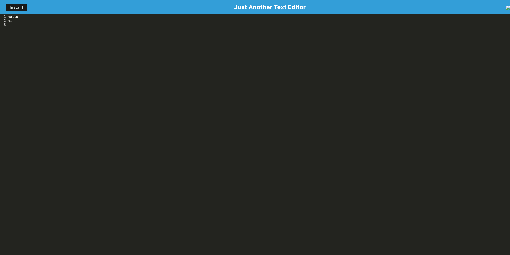

# PWA Text Editor
## Description
A Progressive Web Application (PWA) that allows you to create, edit, and save text notes or code snippets with or without an internet connection. This text editor utilizes IndexedDB for data persistence and can be installed on your desktop or mobile device.

## Installation
To access the project content:
   ```
    1. Use this link to the project repo
    https://github.com/cinvqz/Text-Editor
   ```
    2. Use comand git clone to clone the repo
   ```
    3. Install dependencies using npm install
   ```
    4. Start the server using npm run start
```

## Usage
- Creating Notes: Start typing in the editor area.
- Saving Notes: Click outside the editor area or lose focus to save the content to IndexedDB.
- Offline Use: The application works offline. Any changes made while offline will be saved locally and synced when back online.
- Installing PWA: Click the install button to add the PWA to your desktop or mobile device for quick access. 

Here is an example of the webpage's usage.



## Future Development
This applicaiton needs more javascript code in order for all functionalities to be available and work.

## Credits

[How to write a GOOD README File](https://www.freecodecamp.org/news/how-to-write-a-good-readme-file/)

[Xpert Learning Assistant](https://bootcampspot.instructure.com/courses/5281/external_tools/313)

[Chat GPT](https://chatgpt.com/)